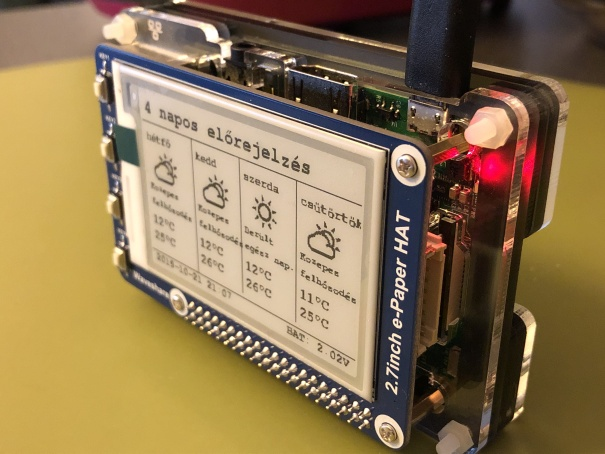
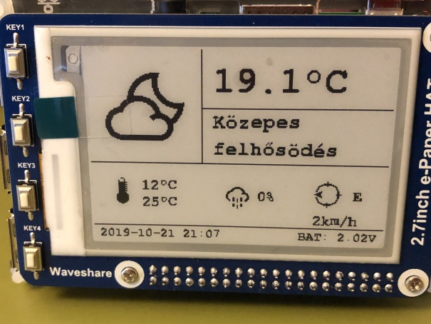

# Weather station for Raspberry with E-Paper HAT



This is a combined RaspberryPi and ESP8266 project for measuring temperature and displaying sensor data and forecast info on the Waveshare 2.7inch E-Paper HAT.

The micro-controller uploads outside temperature to a public IoT data collector site then the Raspberry Pi collects it along with  weather forecast and shows them on a nice E-Paper display. All you need to do is to get the stuff and follow the installation steps. Some bit of extra reading is needed if your are not familiar with ESP8266 development boards and _micropython_ however the Raspberry setup is far easier and you can get the current data from the weather provider as well and leave the ESP stuff. The sensor just adds accuracy and a nice learning experience regarding micro-controllers.

It is mainly a fun project which you can be extend freely. I hope you'll enjoy building it as well.

### The stuff you need:
+ [ESP8266](https://en.wikipedia.org/wiki/ESP8266) development board (I prefer the [Wemos Mini D1](https://wiki.wemos.cc/products:d1:d1_mini))
+ [DS18B20](https://components101.com/sensors/ds18b20-temperature-sensor) temperature sensor
+ [Raspberry Pi 2B/3B/Zero/Zero W](https://www.raspberrypi.org/products/raspberry-pi-3-model-b/)
+ [Waveshare 2.7" E-Ink display HAT for Raspberry Pi 2B/3B/Zero/Zero W](https://www.aliexpress.com/item/32830012306.html) 

## The PI and the E-Ink display

The main script fetches sensor data plus forecast info and handles button events as well.
The refresh runs every 5 minutes and generates three frames which can be displayed with the help of the buttons of the HAT.
For the output see the screenshots dir. Sensor data is pulled from ThingSpeak, forecast from DarkSky.

This E-Paper HAT has four buttons which are used in this project according to the followings:
1. Frame1: sensor temp and today's min-max temperature, current wind speed and direction and precipitation forecast along for today with short weather condition text
2. Frame2: sensor temp, current humidity, air pressure, wind speed and direction, sunrise/sunset
3. Frame3: 4-day weather forecast
4. Clear display

The status line contains the last display refresh time and the battery voltage.
The screenshots were taken the RPi set to Hungarian language - you can alter it very easily, you'll see below.

I borrowed the skeleton of the refresh script from [here](https://diyprojects.io/weather-station-epaper-displaydashboard-jeedom-raspberry-pi-via-json-rpc-api/).

### Scripts


#### _DSweather.py_

Gathers weather info from DarkSky. It fetches current weather and 4-days forecast. Testing:

    python DSweather.py

#### _TSfetch.py_

Collects sensor data from ThingSpeak. If you want to test just run it standalone:

    python TSfetch.py

#### _weather-refresh-2in7.py_

The main script creates frames from data collected from ThingSpeak and DarkSky. It runs every 5 minutes and refreshes the E-Paper display with the first frame.
It also listens to button events and depending on the input it clears the display or shows the relevant frame.
For verbose output you should toggle the _DEBUG_ variable and for testing without E-Paper HAT the *test_mode* variable should be set to _True_.

    python weather-refresh-2in7.py


## Installation steps

### 1. Create accounts
+ [ThingSpeak](https://thingspeak.com/) account
+ [DarkSky](https://darksky.net) account

Both DarkSky and ThingSpeak are free for limited personal usage.

### 2. Clone the git repo into _pi_ user home

``` c++
cd ~
git clone https://github.com/arutz12/Raspberry-Weather-EPD
```

### 3. Optional (but recommended): create a virtual python environment

### 4. Install all the modules in _requirements.txt_
``` shell
pip install -r requirements.txt
```

### 5. Edit paths and install _systemd_ service:

``` shell
sudo cp weather.service /lib/systemd/system
cd /etc/systemd/system/multi-user.target.wants
sudo ln -s /lib/systemd/system/weather.service
```

### 6. Rename the _.env.sample_ to _.env_ and set all the variables 

_LOCALE_ determines the name of the days in the 4-days forecast frame and the _DARKSKY_LANGUAGE_ is responsible for DarkSky weather condition texts.

``` c++
LOCALE = 'en_US.UTF-8'  # change to your language locale
FORECAST_TITLE = '4-days forecast'  # or change to your language

# DarkSky
DARKSKY_API_KEY = ''
DARKSKY_LONGITUDE = 19.223344  # your coordinates
DARKSKY_LATITUDE = 44.556677   # your coordinates
DARKSKY_LANGUAGE = ''  # e.g. 'ENGLISH'
DARKSKY_UNITS = 'SU'  # ('AUTO', 'CA', 'UK2', 'US', 'SU') SU==metric

# ThingSpeak
TS_READ_API_KEY = ''
TS_CHANNEL_ID = ''

# Running without sensor
SENSOR = 0  # set to '1' to collect sensor data

# Running environment
RUN_ENV = ''  # 'production' or 'test'
```

#### Notes
> + The _SENSOR_ global var needs to be set to _1_ if you have sensor otherwise the DarkSky data will be presented as current temperature.
> + The units for temperature and wind speed will be selected automatically.
> + The _micropython_ script needs your ThingSpeak *WRITE_API_KEY* and you must put your ThingSpeak *READ_API_KEY* into the _.env_ file.

### Testing
You can test the whole thing on your own PC (virtual environment recommended) by setting the RUN_MODE to _test_ in _.env_. Then run
``` shell
python weather-refresh-2in7.py
```

and look for _frame[123].bmp_. In this case the EPD and Raspberry-specific stuff is not included, only the frames are rendered which you can check with an image viewer. 

## The sensor
The sensor station is a Wemos Mini D1 ESP8266-based board operating via 2xAA step-up to 5V. The temperature sensor is a DS18B20 which is connected to the D1 pin and the battery voltage is measured on the A0 ADC. The sensor wakes up from deepsleep every every five minutes and sends the data to a [ThingSpeak](https://thingspeak.com/) channel. Depending on your powering setup the measuring unit can last from weeks to months without changing batteries. The Wemos board runs [micropython](http://micropython.org/) which is far easier to use (for me) than Arduino's C++. The script is fairly simple and can be easily customized for more complex DHT sensors - _micropython_ has everything you need for that, just head over to the documentation.

#### Note
> You will need the __urequests__ _micropython_ module which you can obtain from [here](https://github.com/pfalcon/pycopy-lib/blob/master/urequests/urequests) or [here](https://github.com/micropython/micropython-lib/blob/master/urequests). Either build the firmware with it or just copy the file to the root dir.

I put everything (sensor, devboard, batteries) into a waterresistant box and found some place outside, didn't bothered with the aesthetics. (If you're interested I can thoroughly detail the sensor cabling however you can find tons of info on the net. You just need a breadboard, a bunch of jumper cables, connect the sensor and battery to the correct pins and you're done. Without any soldering.)

### Sensor setup

You should edit the global variables of the _+micrpython_ script which relate to Wifi (I configured it with static IP for quicker connection setup), ThingSpeak and sensor PIN.
Copy the script to the root of the board as _main.py_. (I use [RSHELL](https://github.com/dhylands/rshell) for that.)
You should setup a ThingSpeak account, create a channel and put the *WRITE_API_KEY* into the script file.

#### Edit global variables

``` shell
# PINS
PIN_D2 = 4 # Temp sensor PIN
PIN_A0 = 0 # ADC PIN (battery)

# ThingSpeak fields
FIELD_TEMP = 1  # TS Temperature field
FIELD_VOLT = 2  # TS Volt field

# ThingSpeak
TS_WRITE_API_KEY = ''

# Wifi setup
WIFI_SSID = 'WIFI_SSID'
WIFI_PWD = 'WIFI_PWD'
WIFI_IP = '192.168.1.1'
WIFI_IP_MASK = '255.255.255.0'
WIFI_IP_GW = '192.168.1.254'
WIFI_DNS = '192.168.1.1'

```

## Misc
If you don't want to 3D-print a case the [Pimoroni Pibow Coupé](https://shop.pimoroni.com/products/pibow-coupe-for-raspberry-pi-3-b-plus) can be a good choice for RPI 2/3B/3B+.

## Contact

Feel free to contact me if you're stuck anywhere while building this project or just want to give me feedback on that. You can reach me at `antal.rutz@gmail.com`



